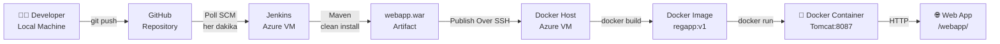

# Jenkins + Docker CI/CD Pipeline on Azure

Bu proje, bir Java web uygulamasının GitHub'dan Azure üzerindeki Docker container'a otomatik olarak build edilip deploy edilmesini sağlayan bir CI/CD pipeline'ı içerir.

## Mimari



## Kullanılan Teknolojiler

| Teknoloji | Amaç |
|-----------|------|
| Azure Virtual Machine | Sunucu altyapısı |
| Jenkins | CI/CD otomasyonu |
| Maven | Java build tool |
| Docker | Container platformu |
| Apache Tomcat | Java web sunucusu |
| GitHub | Kaynak kod yönetimi |

## Proje Yapısı

```
hello-world/
├── pom.xml                          # Ana Maven konfigürasyonu
├── Dockerfile                       # Docker image tanımı
├── server/
│   └── src/main/java/com/example/
│       └── Greeter.java             # Java sınıfı
└── webapp/
    └── src/main/webapp/
        └── index.jsp                # Web uygulaması
```

## Pipeline Akışı

1. **Developer** kodu GitHub'a push eder
2. **Jenkins** Poll SCM ile her dakika değişiklik kontrol eder
3. **Maven** ile `clean install` çalışır, `webapp.war` oluşur
4. **Publish Over SSH** plugin ile WAR dosyası Azure VM'e kopyalanır
5. **Docker** image build edilir ve container başlatılır
6. Uygulama `http://<VM_IP>:8087/webapp/` adresinde erişilebilir olur

## Kurulum

### Gereksinimler

- Azure hesabı
- GitHub hesabı
- Azure VM (Ubuntu 22.04 LTS)

### VM Kurulumu

```bash
# Java
sudo apt install -y openjdk-17-jdk

# Jenkins
sudo wget -O /usr/share/keyrings/jenkins-keyring.asc https://pkg.jenkins.io/debian-stable/jenkins.io-2023.key
echo "deb [signed-by=/usr/share/keyrings/jenkins-keyring.asc] https://pkg.jenkins.io/debian-stable binary/" | sudo tee /etc/apt/sources.list.d/jenkins.list > /dev/null
sudo apt update && sudo apt install -y jenkins
sudo systemctl enable jenkins && sudo systemctl start jenkins

# Maven
sudo apt install -y maven

# Docker
sudo apt install -y docker.io
sudo systemctl enable docker && sudo systemctl start docker
```

### Docker Hazırlığı

```bash
sudo mkdir -p /opt/docker
sudo useradd dockeradmin
sudo passwd dockeradmin
sudo usermod -aG docker dockeradmin
sudo chown -R dockeradmin:dockeradmin /opt/docker
```

### Dockerfile

```dockerfile
FROM tomcat:latest
RUN cp -R /usr/local/tomcat/webapps.dist/* /usr/local/tomcat/webapps
COPY ./*.war /usr/local/tomcat/webapps
```

### Azure NSG Port Kuralları

| Port | Servis |
|------|--------|
| 22 | SSH |
| 8080 | Jenkins |
| 8087 | Web Uygulaması |

## Jenkins Konfigürasyonu

### Gerekli Plugin'ler
- GitHub Integration
- Maven Integration
- Publish Over SSH

### Job Ayarları

- **SCM:** Git → `https://github.com/eminakkurtt/jenkins-docker-cicd.git`
- **Branch:** `*/main`
- **Build Trigger:** Poll SCM → `* * * * *`
- **Goals:** `clean install`

### Exec Command (Post-build SSH)

```bash
cd /opt/docker;
cp webapp/target/*.war .;
docker rm -f registerapp || true;
docker build -t regapp:v1 .;
docker run -d --name registerapp -p 8087:8080 regapp:v1
```

## Uygulamaya Erişim

```
http://<AZURE_VM_PUBLIC_IP>:8087/webapp/
```
